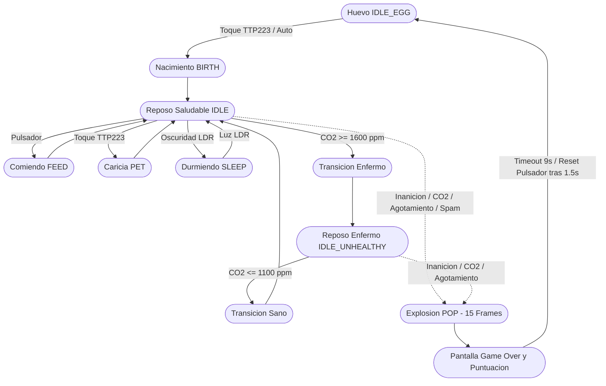

# GotchiLab_

[](https://opensource.org/licenses/MIT)
[](https://www.espressif.com/)
[](https://www.arduino.cc/)
[](https://platformio.org/)
[](https://gotchilab.medialab-uniovi.es/)
[-green.svg)](https://gotchilab.medialab-uniovi.es/)

---

<div align="center">

  <a href="https://gotchilab.medialab-uniovi.es/" target="_blank" rel="noopener noreferrer">
    
  </a>

</div>

---

**GotchiLab_** es una mascota electrónica interactiva de código abierto diseñada y desarrollada en **MediaLab_** para talleres educativos de tecnología y divulgación **STEAM** (Ciencia, Tecnología, Ingeniería, Arte y Matemáticas).

La criatura virtual es un pingüino animado que habita en una pantalla OLED monocromática de 128x64 píxeles gobernada por un microcontrolador **ESP32 DevKit v1**. El firmware reacciona tanto a estímulos directos del usuario (pulsador de alimentación, caricias táctiles capacitivas, conmutador de sonido) como a magnitudes físicas ambientales (nivel de luminosidad mediante fotorresistencia LDR y concentración de dióxido de carbono $CO_2$ mediante sensor óptico NDIR).

---

## Índice

1. [Objetivos Educativos STEAM](#1-objetivos-educativos-steam)
2. [Arquitectura del Firmware y Ciclo de Vida](#2-arquitectura-del-firmware-y-ciclo-de-vida)
3. [Asignación de Pines (Pinout Unificado)](#3-asignación-de-pines-pinout-unificado)
4. [Ajuste y Calibración Analógica del Divisor LDR](#4-ajuste-y-calibración-analógica-del-divisor-ldr)
5. [Bypass Hardware de CO2: Modo Ferias y Demostraciones](#5-bypass-hardware-de-co2-modo-ferias-y-demostraciones)
6. [Máquina de Estados y Secuencia Gráfica de Muerte](#6-máquina-de-estados-y-secuencia-gráfica-de-muerte)
7. [Ciclo de Vida Autocontenido (Sin Persistencia)](#7-ciclo-de-vida-autocontenido-sin-persistencia)
8. [Guía de Compilación y Carga con PlatformIO](#8-guía-de-compilación-y-carga-con-platformio)
9. [GotchiLab_ Web Deployer & Flasheador Web Oficial (V4)](#9-gotchilab_-web-deployer--flasheador-web-oficial-v4)
10. [Estructura del Proyecto](#10-estructura-del-proyecto)
11. [Licencia](#11-licencia)

---

## 1. Objetivos Educativos STEAM

El proyecto busca desmitificar el desarrollo de sistemas embebidos mediante una experiencia tangible:
- **Electrónica Analógica y Digital**: Comprensión práctica de divisores resistivos, saturación de sensores LDR, buses de comunicación serie ($I^2C$), transductores piezoeléctricos PWM y sensores capacitivos táctiles.
- **Calidad del Aire y Conciencia Ambiental**: Introducción a la física de gases y sensores infrarrojos no dispersivos (NDIR) con el Sensirion SCD30, relacionando la concentración de $CO_2$ en recintos cerrados con la salud de la mascota.
- **Ingeniería de Software para Sistemas Embebidos**: Implementación de una Máquina de Estados Finita (FSM), eliminación de bloqueos (`delay()`) en favor de contadores no bloqueantes con `millis()`, gestión de buffers gráficos en RAM y modularidad tolerante a ausencias de hardware.

---

## 2. Arquitectura del Firmware y Ciclo de Vida

El sistema opera bajo un bucle cooperativo en tiempo real gobernado por `code/src/main.cpp`:
- **Capa Gráfica**: 15 cuadros monocromáticos de 128x64 píxeles por animación (1024 bytes/cuadro empaquetados en memoria Flash), renderizados a 5 FPS (200 ms por cuadro) con offsets verticales dinámicos.
- **Audio PWM**: Controlador de sonido sobre el canal 0 del generador LEDC del ESP32 con secuencias de notas no bloqueantes y conmutación de silencio por hardware.
- **Monitor de Constantes Vitales**: Evaluación periódica de hambre, afecto, fatiga por vigilia prolongada y toxicidad por $CO_2$.



---

## 3. Asignación de Pines (Pinout Unificado)

La arquitectura centraliza la asignación de pines en `code/include/pins_config.h`:

| Periférico / Señal | Pin ESP32 | Modo GPIO | Descripción Técnica |
| :--- | :---: | :---: | :--- |
| **I2C SDA** (OLED & SCD30) | `GPIO 22` | $I^2C$ Data | Bus de datos bidireccional compartido |
| **I2C SCL** (OLED & SCD30) | `GPIO 21` | $I^2C$ Clock | Señal de reloj de bus serie compartido |
| **Pulsador Alimentar** | `GPIO 33` | `INPUT_PULLUP` | Pulsador activo a nivel bajo (GND) |
| **Sensor Táctil (TTP223)** | `GPIO 27` | `INPUT` | Entrada digital activa a nivel alto (VCC) |
| **Sensor de Luz (LDR)** | `GPIO 34` | `ADC1_CH6` | Entrada analógica (solo lectura, sin pull-up) |
| **Buzzer Piezoeléctrico** | `GPIO 26` | Salida LEDC | Modulación PWM (Canal 0, 8 bits) |
| **Conmutador Silencio (Mute)** | `GPIO 32` | `INPUT_PULLUP` | Puente a GND conmuta entre sonido y silencio |
| **Modo Ferias (Bypass CO2)** | `GPIO 25` | `INPUT_PULLUP` | Jumper a GND: anula inicialización de $CO_2$ |

---

## 4. Ajuste y Calibración Analógica del Divisor LDR

### Topología del Circuito
El sensor de luz implementa un divisor de tensión resistivo entre la línea de 3.3V y masa:

```text
       3.3V (VCC)
           │
         ┌─┴─┐
         │LDR│ (Fotorresistencia)
         └─┬─┘
           ├───────> GPIO 34 (ADC1_CH6 del ESP32)
         ┌─┴─┐
         │10k│ (Resistencia Pull-Down de 10 kΩ)
         └─┬─┘
           │
          GND
```

### Ecuación de Transferencia
$$V_{out} = V_{CC} \cdot \left( \frac{R_{pull}}{R_{LDR} + R_{pull}} \right)$$

$$\text{Cuentas ADC (12 bits)} = \left( \frac{V_{out}}{3.3\,\text{V}} \right) \cdot 4095$$

- **En luz ambiente**: La resistencia $R_{LDR}$ cae a valores bajos (~1 kΩ a 5 kΩ), por lo que $V_{out} \approx 2.75\,\text{V}$ (ADC $\approx 3412$).
- **En oscuridad (tapado)**: La resistencia $R_{LDR}$ aumenta drásticamente (> 50 kΩ a 100+ kΩ), por lo que $V_{out}$ cae por debajo de $1.0\,\text{V}$ (ADC < 1240).

### Calibración Paso a Paso con Multímetro
1. Configura el multímetro en escala de tensión continua (**DC Voltios**, rango 20V o 2V).
2. Conecta la sonda negra a **GND** y la sonda roja al punto medio del divisor (**GPIO 34**).
3. Mide la tensión en condiciones de iluminación de trabajo ($V_{luz} \approx 2.5\,\text{V} - 3.0\,\text{V}$).
4. Cubre completamente la fotorresistencia con el dedo y anota la tensión mínima ($V_{oscuro} \approx 0.5\,\text{V} - 1.5\,\text{V}$).
5. Establece el punto de conmutación en el valor medio:
   $$V_{umbral} = \frac{V_{luz} + V_{oscuro}}{2}$$
   $$\text{LDR\_DARK\_THRESHOLD} = \left(\frac{V_{umbral}}{3.3\,\text{V}}\right) \cdot 4095$$
6. Actualiza la constante `LDR_DARK_THRESHOLD` en `code/include/config.h` (valor predeterminado: **2856**, correspondiente a ~2.30V).

### Telemetría Serie de Depuración
Para verificar lecturas en tiempo real sin cálculos manuales, activa la directiva en `code/include/config.h`:
```cpp
#define DEBUG_LDR_CALIBRATION 1
```
Abre la consola serie a **115200 baudios** para observar el volcado continuo:
```text
[LDR DEBUG] ADC Raw: 3120/4095 | Voltaje: 2.512 V | Umbral: 2856 | Estado: ILUMINADO (DESPIERTO)
[LDR DEBUG] ADC Raw: 1150/4095 | Voltaje: 0.926 V | Umbral: 2856 | Estado: OSCURO (DORMIR)
```

---

## 5. Bypass Hardware de CO2: Modo Ferias y Demostraciones

En eventos masivos, ferias de ciencias o aulas cerradas, la concentración de $CO_2$ suele superar con facilidad los 1600 ppm, provocando que la mascota enferme continuamente o muera por asfixia en menos de un minuto durante las explicaciones.

Para solventarlo sin recompilar el código:
1. **Jumper Físico**: Se define `PIN_FAIR_MODE` en `GPIO 25` configurado con `INPUT_PULLUP`.
2. **Detección en Arranque**: Durante el `setup()`, el microcontrolador verifica el estado de `GPIO 25`:
   - Si está conectado a **GND** mediante un jumper o cable Dupont:
     - Se omite la inicialización de la librería del sensor SCD30 y el tráfico por el bus $I^2C$.
     - La variable interna `co2SensorEnabled` pasa a `false`.
     - Las lecturas devuelven un valor nominal limpio y constante de **400 ppm**.
     - La máquina de estados ignora totalmente las penalizaciones y alertas respiratorias.
   - Si el jumper está abierto (flotante / HIGH): El sensor NDIR opera con normalidad.

### Exclusión Completa en Compilación
Si se construye una versión económica de la mascota sin el sensor Sensirion SCD30 instalado físicamente, puede excluirse íntegramente del binario definiendo en `code/include/config.h`:
```cpp
#define USE_CO2_SENSOR 0
```

---

## 6. Máquina de Estados y Secuencia Gráfica de Muerte

Para ofrecer un dramatismo lúdico intuitivo y eliminar transiciones abruptas:

1. **Detección de Fallecimiento**: Cuando se cumple cualquier condición crítica (inanición, asfixia por $CO_2$, privación de sueño o sobrealimentación), la función `triggerDeath(reason)` captura la causa y el timestamp.
2. **Ejecución Obligatoria de Animación "POP"**:
   - El sistema entra en el estado `POP` reproduciendo los 15 cuadros de explosión/desvanecimiento (`penguin_pop_anim`) a 200 ms por cuadro (3 segundos en total).
   - Se silencia cualquier sonido ambiental y se reproduce el efecto acústico de explosión.
3. **Transición a Pantalla de Game Over**:
   - Una vez finalizado el cuadro 14 de `POP`, la máquina conmuta formalmente a `DEAD`.
   - Se activa la marcha fúnebre mediante PWM.
   - Se limpia el buffer de vídeo y se imprime la esquela con:
     * Causa específica de defunción.
     * Segundos totales vividos tras la eclosión.
     * Cuidados totales (caricias táctiles y alimentaciones con éxito).
     * Puntuación matemática final.
4. **Buffer Libre de Parpadeos (*Flicker-Free*)**:
   - Todas las operaciones de renderizado se realizan exclusivamente en la memoria RAM del ESP32 (buffer de 1024 bytes de Adafruit_SSD1306).
   - La pantalla solo se actualiza en bloque mediante una única transacción $I^2C$ (`display.display()`), garantizando ausencia total de artefactos visuales.

---

## 7. Ciclo de Vida Autocontenido (Sin Persistencia)

Siguiendo la especificación de diseño educativo:
- **Cero Persistencia**: Se eliminan todas las dependencias de memoria no volátil (`Preferences.h`, `EEPROM.h`, NVS flash).
- **Reinicio Integral**: Al expirar el tiempo de la pantalla de muerte (9 segundos) o al presionar cualquier botón tras 1.5 segundos de gracia, la función `resetToEggState()` restablece de forma absoluta e incondicional todos los temporizadores, acumuladores de daño, banderas de estado, contadores de spam y variables de felicidad a sus valores base.
- Cada partida es un experimento nuevo, autónomo e independiente.

---

## 8. Guía de Compilación y Matriz Modular (PlatformIO)

### Requisitos Previos
- [PlatformIO Core (CLI)](https://docs.platformio.org/en/latest/core/index.html) o extensión oficial para [VS Code](https://code.visualstudio.com/).
- Cable USB de datos conectado al ESP32.

### Matriz Modular de Perfiles de Hardware (7 Variantes)
El firmware implementa desacoplamiento condicional mediante flags de preprocesador en `code/platformio.ini`, permitiendo generar binarios optimizados para cualquier combinación de periféricos:

| Entorno PlatformIO | CO₂ (SCD30) | Luz (LDR) | Táctil (TTP223) | Audio (Buzzer) | Descripción del Perfil |
| :--- | :---: | :---: | :---: | :---: | :--- |
| `full` (default) | ✅ Sí | ✅ Sí | ✅ Sí | ✅ Sí | Configuración completa oficial GotchiLab_ |
| `no_co2` | ❌ No | ✅ Sí | ✅ Sí | ✅ Sí | Recomendado: Optimización de coste de sensor óptico |
| `no_co2_silent` | ❌ No | ✅ Sí | ✅ Sí | ❌ No | Visual interactivo sin sonido ni sensor CO₂ |
| `no_co2_no_touch` | ❌ No | ✅ Sí | ❌ No | ✅ Sí | Modo auto-eclosión sin sensor capacitivo |
| `no_co2_no_light` | ❌ No | ❌ No | ✅ Sí | ✅ Sí | Modo siempre despierto sin ciclo día/noche |
| `minimal` | ❌ No | ❌ No | ❌ No | ❌ No | Solo OLED y pulsador de alimentación |
| `full_silent` | ✅ Sí | ✅ Sí | ✅ Sí | ❌ No | Monitoreo ambiental completo en silencio |

```bash
cd code

# Compilar una variante específica:
pio run -e no_co2

# O compilar todas las variantes simultáneamente:
pio run
```

---

## 9. GotchiLab_ Web Deployer & Flasheador Web Oficial (V4)

<div align="center">

  <a href="https://gotchilab.medialab-uniovi.es/" target="_blank" rel="noopener noreferrer">
    
  </a>

</div>

A partir de la versión **V4**, GotchiLab_ incorpora su propio entorno de programación web interactivo disponible directamente en la nube en **[gotchilab.medialab-uniovi.es](https://gotchilab.medialab-uniovi.es/)**, eliminando por completo la necesidad de instalar herramientas de desarrollo como VS Code, PlatformIO o Python para usuarios, familias y alumnos en talleres STEAM.

> [!TIP]
> ### 🚀 ¿Cómo cargar tu GotchiLab_ en 3 pasos?
> 1. **Conecta tu ESP32** al PC con un cable USB de datos.
> 2. **Abre el flasheador** en Google Chrome o Microsoft Edge: [gotchilab.medialab-uniovi.es](https://gotchilab.medialab-uniovi.es/).
> 3. **Elige tus sensores**, pulsa **"Conectar y Flashear"** y selecciona tu placa. ¡El pingüino cobrará vida en ~30 segundos!

### Características Principales:
1. **Flasheo Web Serial Nativo**: Integración directa con `esptool-js` en el navegador (Google Chrome / Microsoft Edge). Graba el microcontrolador por USB a 460800 baudios en offset unificado `0x00000000`.
2. **Simulador OLED en Vivo**: Canvas animado a 5 FPS que emula el display SSD1306 de 128x64 píxeles con la estética luminosa del pingüino en tiempo real (huevo, nacimiento, reposo, comida, mimos, sueño).
3. **Selector Dinámico de Sensores**: 4 interruptores interactivos (CO₂, Luz, Táctil y Voz) con descripciones pedagógicas. La interfaz resuelve automáticamente la variante binaria óptima del manifiesto (`web/data/manifest.json`).
4. **Consola de Telemetría Serie**: Terminal integrado en pantalla que muestra el progreso del flasheo en 5 etapas (Puerto, Sincronización, Descarga, Flash 0x0 y Verificación).

### Lanzamiento Local Rápido (1 Clic)
Para arrancar el deployer web localmente bajo un contexto seguro (`http://localhost:8000/web/`):
```cmd
iniciar_web.bat
```
El script inicia automáticamente un servidor HTTP local en Python y abre el navegador por defecto.

### Compilación y Empaquetado de la Matriz (`build_deploy.bat`)
Para compilar todas las variantes de firmware y generar los binarios unificados `0x0` listos para la web:
```cmd
build_deploy.bat
```
Este pipeline ejecuta `scripts/build_matrix.py`, que:
1. Compila los 7 perfiles PlatformIO.
2. Combina bootloader (`0x1000`), particiones (`0x8000`) y firmware (`0x10000`) en un único archivo fusionado por variante en `web/binaries/`.
3. Actualiza el manifiesto de versiones `web/data/manifest.json`.

---

## 10. Estructura del Proyecto

```text
GotchiLab_/
├── LICENSE                         # Licencia de software de código abierto MIT
├── README.md                       # Manual técnico y guía de ingeniería
├── prompt.md                       # Especificación maestra del sistema
├── GotchiLab_.pdf                  # Guía didáctica para talleres presenciales
├── iniciar_web.bat                 # Lanzador de un solo clic para el Flasheador Web local
├── docs/                           # Documentación auxiliar y capturas de interfaz
│   └── capturas/                   # Capturas del deployer y spotlight
├── Esquematico/                    # Esquemas Fritzing (.fzz), partes (.fzpz), PDF y PNG
├── PlacaSTL/                       # Archivos de fabricación 3D para chasis y PCB
├── VideoToCarray/                  # Pipeline Python/OpenCV para conversión de vídeo a C
├── scripts/
│   ├── build_matrix.py             # Compilador y unificador esptool de las 7 variantes
│   └── extract_animations.py       # Extractor de cuadros de animación a formato web
├── web/                            # GotchiLab_ Web Serial Deployer (V4)
│   ├── index.html                  # Panel de control de interfaz de usuario
│   ├── assets/                     # Identidad gráfica, iconos y botón web flasher
│   ├── css/
│   │   └── styles.css              # Estética Dark Cybernetic Lab & Glassmorphism
│   ├── js/
│   │   ├── app.js                  # Motor Web Serial, FSM visual y selector de hardware
│   │   ├── tour.js                 # Sistema de tutorial guiado interactivo (Spotlight)
│   │   └── animations.js           # Cuadros de animación 128x64 codificados en Base64
│   ├── data/
│   │   └── manifest.json           # Manifiesto JSON con las 7 variantes de firmware
│   └── binaries/                   # Binarios unificados (offset 0x00000000)
└── code/
    ├── platformio.ini              # Matriz de 7 perfiles modulares (ESP32 DevKit v1)
    ├── include/
    │   ├── pins_config.h           # Centralización de GPIOs y asignación de pines
    │   └── config.h                # Feature flags, umbrales y tiempos de supervivencia
    └── src/
        ├── main.cpp                # FSM principal, gestión gráfica, audio y loop vital
        ├── config/
        │   └── config.h            # Reenvío de compatibilidad hacia include/config.h
        ├── sensors/
        │   ├── sensors.h           # Declaración del subsistema de sensores
        │   └── sensors.cpp         # SCD30 con bypass y botón
        └── animations/             # Cuadros de animación monocromáticos en Flash (15 frames)
```

---

## 11. Licencia

Este proyecto está distribuido bajo la licencia de código abierto **MIT**. Consulta el archivo [LICENSE](LICENSE) para más detalles.

Desarrollado con pasión para la comunidad maker y educativa por **José Escobedo Vázquez** en **MediaLab_**.
