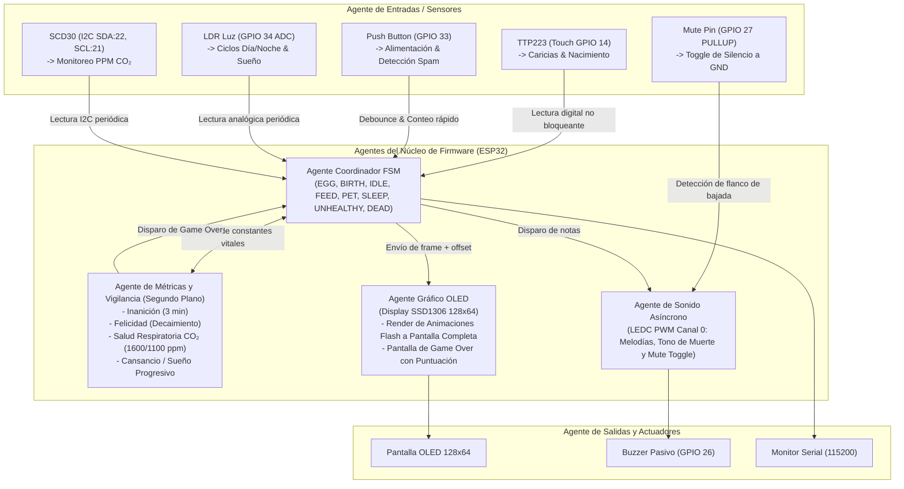

# AGENTS DIRECTORY & SYSTEM ARCHITECTURE: GOTCHILAB_

> **Contexto de Misión**: Este archivo define los roles de agente, contratos de subsistemas, reglas operativas y protocolos de evolución para el firmware de **GotchiLab_** dentro de `code/`. Ha sido concebido bajo estándares de ingeniería de software senior para asegurar que cualquier agente o programador pueda comprender, auditar, compilar y ampliar el proyecto sin romper su naturaleza modular y reactiva.

---

## 1. Misión del Sistema

La misión es dotar al GotchiLab_ de una dinámica de juego Tamagotchi completa, didáctica, inmersiva y robusta:
1. **Modo Inmersivo (Estados de Fondo)**:
   - La pantalla OLED de 128x64 está **limpia de barras superiores** (`SHOW_STATS_OVERLAY 0`), permitiendo visualizar las animaciones del pingüino a pantalla completa.
   - Toda la lógica de supervivencia opera en segundo plano: hambre, felicidad, fatiga y salud respiratoria.
   - El jugador debe estar atento de forma intuitiva a cuidar a su mascota.
2. **Ciclo de Vida y Causas de Muerte**:
   - **Inanición**: Muerte tras 3 minutos (`STARVATION_TIME_MS = 180000 ms`) continuos sin comer.
   - **Sobrealimentación (`POP`)**: Muerte explosiva si se pulsa repetidamente el botón en una ventana reducida.
   - **Asfixia / Intoxicación por $CO_2$**: Muerte tras exposición prolongada a valores altos de $CO_2$ sin ventilación (`MAX_CO2_EXPOSURE_MS = 60000 ms`).
   - **Agotamiento Extremo**: Muerte si no se le permite dormir en la oscuridad durante un tiempo prolongado (`MAX_TIME_AWAKE_MS = 150000 ms`).
3. **Función de Silencio por Hardware (`MUTE_PIN`)**:
   - Pin `GPIO 27` configurado como `INPUT_PULLUP`.
   - Conexión a tierra (GND) conmuta entre modo silencioso y modo con sonido (con tono confirmatorio).
4. **Respeto a la Modularidad por Hardware**:
   - Si un sensor está desactivado en `config.h` (`USE_*_SENSOR 0`), ni sus funciones asociadas ni sus condiciones de muerte o desgaste se ejecutan, garantizando que el sistema nunca muera por sensores ausentes.
5. **Pantalla Final de Game Over y Puntuación**:
   - Sonido de derrota fúnebre estilizado mediante PWM LEDC sin bloqueos de CPU (si no está muteado).
   - Pantalla detallada con la **Causa exacta de la muerte**, **Tiempo de supervivencia (s)**, número de cuidados recibidos (caricias y comidas) y la **Puntuación Final** ponderada en español.

---

## 2. Diagrama de Contexto de Agentes y Subsistemas



---

## 3. Catálogo de Roles de Agentes de Software

### Agente 1: Coordinador FSM (`main.cpp` - Ciclo de Vida)
- **Responsabilidad**: Orquestar el flujo de animaciones y cambios de estado.
- **Entradas**: Eventos de usuario (touch, botón), eventos ambientales (oscuridad, $CO_2$) y eventos de muerte de `Stats_Agent`.
- **Garantías**:
  - Nunca usa `delay()` en el bucle principal.
  - Asegura que las animaciones bloqueantes (`BIRTH`, `FEED`, `PET`, `POP`, `TRANSITIONS`) completen sus 15 cuadros antes de regresar al estado base.
  - Al recibir una condición mortal, deriva a `triggerDeath(reason)`.

### Agente 2: Vigilante de Estadísticas y Reglas de Muerte (`Stats_Agent`)
- **Responsabilidad**: Gestionar el decaimiento de hambre, felicidad, cansancio e intoxicación en segundo plano.
- **Contrato de Aislamiento**:
  ```cpp
  if (hasButtonFeature()) { /* Monitoreo de hambre e inanición a 3 min */ }
  if (hasCO2Feature())    { /* Monitoreo de exposición a CO2 crítico */ }
  if (hasLightFeature())  { /* Monitoreo de energía despierto y sueño */ }
  if (hasTouchFeature())  { /* Monitoreo de decaimiento de afecto */ }
  ```
- **Parámetros en `config.h`**:
  - `STARVATION_TIME_MS`: 180000 ms (3 minutos sin comer).
  - `MAX_CO2_EXPOSURE_MS`: 60000 ms (60 segundos en $CO_2 \ge 1600\text{ ppm}$).
  - `MAX_TIME_AWAKE_MS`: 150000 ms (2.5 minutos despierto sin descansar).
  - `HAPPINESS_DECAY_MS`: 15000 ms por nivel de afecto.
  - `SLEEP_RECOVERY_MULTIPLIER`: 3x (velocidad de descanso progresivo durmiendo).
  - `CO2_CLEAN_RECOVERY_MULTIPLIER`: 3x (disipación acelerada al respirar aire limpio).

### Agente 3: Renderizador Gráfico (`Render_Agent`)
- **Responsabilidad**: Dibujar los cuadros de animación con sus offsets verticales.
- **Pantalla Completa**: Al estar `SHOW_STATS_OVERLAY 0`, la pantalla se dedica completamente a la mascota sin líneas ni recuadros superiores.
- **Pantalla de Muerte**: Limpia pantalla y despliega causa en español, tiempo vivido, acciones y puntuación final.

### Agente 4: Sintetizador de Audio No Bloqueante y Silencio (`Audio_Agent`)
- **Responsabilidad**: Alimentar el periférico LEDC PWM sin retener el microcontrolador y gestionar el silencio por hardware.
- **Control de Silencio**:
  - `MUTE_PIN` (GPIO 27) puenteado a GND alterna el estado `isMuted`.
  - Cuando está en silencio, corta cualquier tono activo y bloquea nuevas notas.
  - Al desmutear, emite un tono corto de confirmación (880 Hz).

---

## 4. Fórmula de la Puntuación Final

Cuando la mascota fallece, el algoritmo calcula el resultado final de la partida considerando cuidado integral y longevidad:

$$\text{Puntuación} = (T_{\text{vivo}} \times 10) + (N_{\text{comidas}} \times 15) + (N_{\text{caricias}} \times 20) - \text{Penalización}$$

- $T_{\text{vivo}}$: Segundos transcurridos desde la eclosión del huevo.
- $N_{\text{comidas}}$: Total de veces alimentado sin llegar a la sobrealimentación.
- $N_{\text{caricias}}$: Total de interacciones afectivas registradas por el sensor táctil.
- **Penalización**: Se restan 50 puntos si la muerte fue por negligencia directa (inanición por olvido o sobrealimentación/POP). La puntuación nunca será inferior a 0.

---

## 5. Instrucciones para Desarrollo y Despliegue

1. **Compilación / Carga**:
   - Abrir la carpeta `code/` en VS Code con PlatformIO.
   - Conectar el ESP32 DevKit v1 por USB y verificar el puerto COM.
   - Ejecutar:
     ```bash
     pio run -t upload --upload-port COM12
     ```
2. **Simulación sin sensores conectados**:
   - Abrir `code/src/config/config.h`.
   - Modificar cualquier directiva a `0` (ejemplo: `#define USE_CO2_SENSOR 0`).
   - Recompilar; el firmware se adaptará sin cuelgues ni falsos Game Over.
