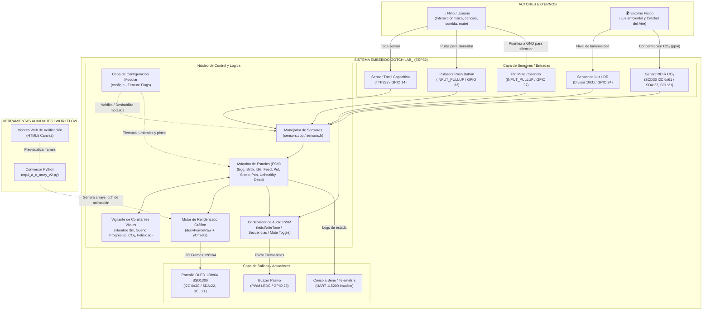

# SYSTEM PROMPT & SPECIFICATION: GOTCHILAB_

> **Propósito de este archivo**: Este documento (`prompt.md`) actúa como la especificación técnica completa y plantilla de prompt para generar desde cero, comprender, mantener y extender el proyecto **GotchiLab_**. Puede suministrarse a cualquier LLM / agente de código o desarrollador para reconstruir o ampliar el sistema de forma consistente con su arquitectura y diseño modular original.

---

## 1. Visión General del Proyecto

**GotchiLab_** es una mascota electrónica interactiva (tipo Tamagotchi educativo) diseñada en **MediaLab_** para talleres formativos y divulgación STEAM.
La mascota es un pingüino animado en una pantalla OLED monocromática de 128x64 píxeles controlada por un microcontrolador **ESP32 DevKit v1**. El comportamiento de la criatura reacciona tanto a interacciones táctiles y pulsadores como a variables ambientales (luz y niveles de dióxido de carbono $CO_2$) y cuenta con un sistema de muteo por hardware y constantes vitales en segundo plano.

### Características Clave:
- **Modularidad por Hardware**: Arquitectura desacoplada mediante directivas de precompilación (`#define USE_*_SENSOR`). Si un sensor no está físicamente conectado, el firmware ajusta su comportamiento dinámicamente sin fallos ni bloqueos.
- **Máquina de Estados Finita (FSM)**: Estados bien diferenciados para huevo, nacimiento, reposo, caricia, alimentación, sueño, transición ambiental (sano/enfermo), sobrealimentación (explosión) y muerte (`DEAD`).
- **Modo Inmersivo (Estados en Segundo Plano)**: Pantalla limpia de 128x64 dedicada en su totalidad a las animaciones; los estados de hambre, felicidad, cansancio y $CO_2$ operan de fondo obligando a un cuidado intuitivo continuo.
- **Control de Silencio por Hardware (`MUTE_PIN`)**: Pin GPIO 27 con pull-up que, al puentearse a tierra (GND), conmuta entre modo silencioso y modo con volumen (con tono confirmatorio).
- **Animaciones en Memoria Flash**: Animaciones monocromáticas de 15 cuadros (128x64 píxeles, 1024 bytes/cuadro, 5 FPS, 200 ms/cuadro) con arrays de desplazamiento vertical (`yOffset`).
- **Retroalimentación Sonora**: Buzzer pasivo controlado por PWM (`ledc`) con secuencias de notas no bloqueantes y marcha fúnebre en Game Over.
- **Herramientas Auxiliares de Pipeline**: Script en Python con OpenCV (`mp4_a_c_array_v2.py`) para convertir vídeos MP4 directamente a arrays binarios en C/C++ compatibles con el display OLED SSD1306.

---

## 2. Diagrama de Contexto del Sistema



---

## 3. Especificación Técnica de Hardware y Pines

### 3.1 Lista de Componentes (BOM)
1. **Microcontrolador**: ESP32 DevKit v1 (30 o 36 pines).
2. **Display**: Pantalla OLED 0.96" SSD1306 I2C (128x64, dirección 0x3C).
3. **Sensor CO₂**: Sensirion SCD30 (NDIR óptico de alta precisión, interfaz I2C).
4. **Sensor Táctil**: TTP223 módulo capacitivo digital.
5. **Sensor de Luz**: Fotorresistencia LDR en divisor de tensión con resistencia pull-down de 10kΩ.
6. **Actuador Sonoro**: Buzzer piezoeléctrico pasivo.
7. **Pulsador**: Pulsador normalmente abierto (NA).
8. **Placa de pruebas**: Protoboard y cableado Dupont.

### 3.2 Asignación de Pines (Pinout)

| Componente | Pin del ESP32 | Modo / Configuración | Función |
| :--- | :--- | :--- | :--- |
| **OLED SDA** | GPIO 22 | I2C Data (Wire) | Bus de datos display (compartido) |
| **OLED SCL** | GPIO 21 | I2C Clock (Wire) | Bus de reloj display (compartido) |
| **SCD30 SDA** | GPIO 22 | I2C Data (Wire) | Bus de datos sensor CO₂ |
| **SCD30 SCL** | GPIO 21 | I2C Clock (Wire) | Bus de reloj sensor CO₂ |
| **Pulsador** | GPIO 33 | `INPUT_PULLUP` | Detección de pulsación a GND (Comer / Spam) |
| **Sensor Touch** | GPIO 14 | `INPUT` digital | Señal digital HIGH cuando se toca (Caricia / Nacer) |
| **Sensor Luz (LDR)** | GPIO 34 | `INPUT` analógico (ADC1_CH6) | Lectura de voltaje de luminosidad |
| **Buzzer** | GPIO 26 | Salida LEDC (Canal 0) | Generación de tonos audibles mediante PWM |
| **Mute (Silencio)** | GPIO 27 | `INPUT_PULLUP` | Puentear a GND conmuta entre silencio y sonido |

---

## 4. Estructura de Archivos del Proyecto

```text
GotchiLab_/
├── code/
│   ├── platformio.ini              # Configuración PlatformIO (esp32dev, lib_deps)
│   ├── agents.md                   # Definición de arquitectura de agentes y contratos
│   └── src/
│       ├── main.cpp                # FSM principal, audio, mute, lógica vital y Game Over
│       ├── config/
│       │   └── config.h            # Parámetros, constantes, pines y feature flags
│       ├── sensors/
│       │   ├── sensors.h           # Declaración del subsistema de sensores
│       │   └── sensors.cpp         # Implementación de lectura SCD30 y botones
│       └── animations/             # Arrays C con frames monocromáticos y offsets
│           ├── penguin_birth_anim.[c|h]
│           ├── penguin_feed_anim.[c|h]
│           ├── penguin_idle_anim.[c|h]
│           ├── penguin_idle_egg_anim.[c|h]
│           ├── penguin_idle_unhealthy_anim.[c|h]
│           ├── penguin_pet_anim.[c|h]
│           ├── penguin_pop_anim.[c|h]
│           ├── penguin_sleep_anim.[c|h]
│           └── penguin_transition_unhealthy_anim.[c|h]
├── Esquematico/                    # Esquemas Fritzing (.fzz), partes (.fzpz), PDF y PNG
├── VideoToCarray/                  # Herramientas de extracción de frames
│   ├── mp4_a_c_array_v2.py         # Script Python de vídeo a arrays C empaquetados
│   ├── ComprobarBitArray.html      # Test de formato y bits
│   ├── VisorAnimacionCArrayOLED.html # Simulador web de animación en display OLED
│   └── Recursos/                   # Vídeos fuente MP4 y assets
├── GotchiLab_.pdf                  # Documento didáctico para participantes del taller
├── README.md                       # Documentación rápida del repositorio
└── prompt.md                       # ESTE ARCHIVO: Especificación maestra y prompt de generación
```

---

## 5. Arquitectura del Firmware y Lógica de Estados (FSM)

### 5.1 Definición de Estados (`AnimationState`)
```cpp
enum AnimationState {
    FEED = 0,                    // Comiendo (bloqueante)
    IDLE = 1,                    // Pingüino sano en reposo
    PET = 2,                     // Recibiendo caricia (bloqueante)
    SLEEP = 3,                   // Dormido (pausado en frame 10 mientras siga oscuro)
    POP = 4,                     // Sobrealimentado / Explosión (bloqueante)
    IDLE_EGG = 5,                // Huevo esperando eclosión
    BIRTH = 6,                   // Eclosión / Nacimiento (bloqueante)
    IDLE_UNHEALTHY = 7,          // Pingüino enfermo (CO₂ alto)
    TRANSITION_TO_UNHEALTHY = 8, // Transición de sano a enfermo (bloqueante)
    TRANSITION_TO_HEALTHY = 9,   // Transición de regreso a sano (reversa, bloqueante)
    DEAD = 10                    // Pantalla de Game Over y cálculo de puntuación
};
```

### 5.2 Reglas de Supervivencia, Alertas Acústicas y Muerte
1. **Inanición (3 minutos)**: Si transcurren más de `STARVATION_TIME_MS` (180,000 ms) sin alimentar al pingüino, muere por inanición.
   - *Alerta Acústica de Hambre*: A partir de 1 minuto sin comer (`HUNGER_ALERT_TIME_MS`), genera un sonido realista de **estómago rugiendo** (`SOUND_HUNGER_GROWL`) cada 20 segundos.
2. **Sobrealimentación (`POP`) y Protección de Nacimiento**:
   - Si se pulsa el botón 5 veces en menos de 2.2 segundos, explota y muere (`POP`).
   - *Inmunidad antes y durante el Nacimiento*: Antes de nacer (huevo `IDLE_EGG` o animación `BIRTH`), pulsar el botón no acumula spam ni produce muertes. Además, cuenta con un período de gracia de 5 segundos tras nacer (`NEWBORN_GRACE_PERIOD_MS`) inmune a sobrealimentación por pulsaciones rápidas.
3. **Asfixia por $CO_2$**: Activación a $\ge 1600\text{ ppm}$ y recuperación a $\le 1100\text{ ppm}$. Si acumula 60 segundos continuos en atmósfera contaminada (`MAX_CO2_EXPOSURE_MS`), muere por asfixia.
   - *Alerta Acústica de Enfermo / Tos*: Mientras el $CO_2$ esté alto, tose periódicamente (`SOUND_COUGH`, cada 12 segundos) simulando carraspeos secos por el aire viciado.
4. **Agotamiento Extremo (2.5 minutos)**: Si permanece despierto sin descanso, acumula fatiga. Al apagar la luz / tapar el LDR, recupera energía de forma progresiva (3x más rápido). Si no duerme en 150 segundos, muere por agotamiento.
   - *Alerta Acústica de Sueño*: Si permanece despierto más de 70 segundos (`SLEEP_ALERT_TIME_MS`), emite periódicamente una **melodía somnolienta descendente** dulce (`SOUND_SLEEPY`) pidiendo descansar, la cual también sirve de nana al entrar en modo sueño.
5. **Game Over, Puntuación y Reinicio**:
   $$\text{Puntuación} = (T_{\text{vivo}} \times 10) + (N_{\text{comidas}} \times 15) + (N_{\text{caricias}} \times 20) - \text{Penalizaciones}$$
   La pantalla final se muestra durante 9 segundos (o se reinicia inmediatamente si el usuario pulsa botón o touch tras 1.5s). Al volver al huevo, **absolutamente todos los valores, acumuladores, estadísticas, frecuencias de buzzer y timestamps se reinician desde cero**.

---

## 6. Configuración de Módulos Opcionales (`config.h`)

```c
#define USE_BUTTON_SENSOR       1  // 0: Sin botón ni muerte por hambre
#define USE_TOUCH_SENSOR        1  // 0: Eclosión automática y sin caricias
#define USE_LIGHT_SENSOR        1  // 0: Sin modo sueño ni muerte por agotamiento
#define USE_CO2_SENSOR          1  // 0: Siempre sano a 400 ppm
#define USE_BUZZER              1  // 0: Modo silencioso total
#define SHOW_STATS_OVERLAY      0  // 0: Modo inmersivo pantalla limpia, 1: HUD visible
```

---

## 7. Prompt Operativo para LLMs / Agentes de Código

Copia y pega el siguiente bloque como instrucción para cualquier LLM cuando quieras que trabaje sobre este proyecto:

```markdown
Eres el ingeniero de firmware y hardware responsable de GotchiLab_.
Actúa basándote en las especificaciones del archivo `prompt.md`:
1. El proyecto corre en ESP32 DevKit v1 usando PlatformIO / Arduino Framework.
2. La arquitectura debe mantener la modularidad absoluta (#if USE_*_SENSOR). No asumas que todos los periféricos están conectados.
3. El loop principal (`loop()`) es completamente asíncrono y no bloqueante mediante contadores `millis()`.
4. Toda nueva animación debe cumplir el formato de 15 frames, 128x64 bits y array de offsets.
5. El buzzer utiliza el canal LEDC 0 de ESP32 sin bloquear la CPU y respeta el estado de silencio en GPIO 27 (MUTE_PIN).
6. Si sugieres cambios o nuevo código, entrega el diff o el código completo respetando la estructura modular `config.h`, `sensors/`, `animations/` y `main.cpp`.
```
